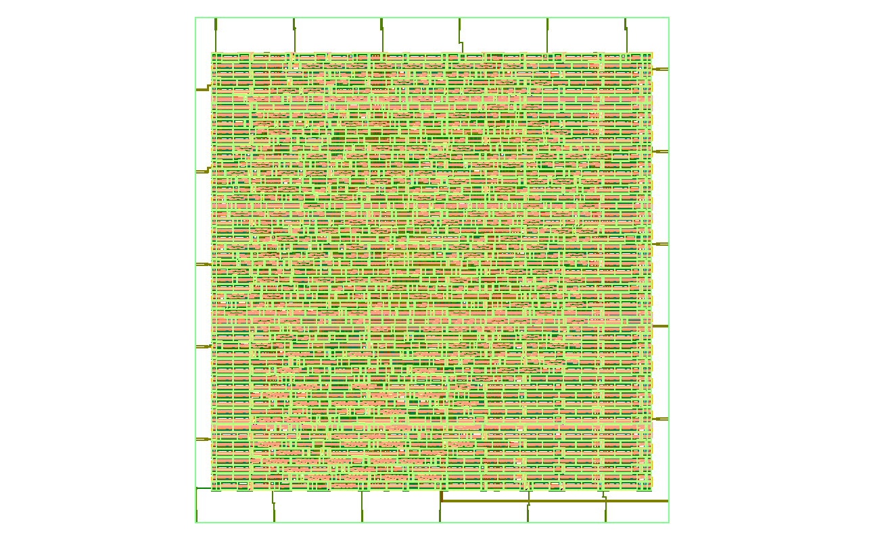

# Asynchronous FIFO ASIC Implementation

## Overview

This repository presents the RTL design and physical implementation of a parameterized asynchronous FIFO using the SKY130 open-source process design kit (PDK). The design enables reliable data transfer between independent clock domains through Gray-code pointer synchronization and dual flip-flop synchronizers.

The implementation was completed using the OpenLane ASIC flow, covering RTL synthesis, floorplanning, placement, clock tree synthesis, routing, and post-route static timing analysis, resulting in a manufacturable GDSII layout.

---

## Design Features

- Parameterized FIFO depth and data width
- Independent read and write clock domains
- Binary pointer implementation with Gray-code conversion
- Two-stage synchronizers for clock domain crossing
- Full and Empty status generation
- Complete RTL-to-GDSII implementation
- Timing closure achieved after routing

---

## Physical Implementation

<p align="center">

</p>

<p align="center">
Final routed GDSII layout generated using the SKY130 PDK and OpenLane.
</p>

---

## Implementation Flow

```
RTL Design
    │
    ▼
Functional Verification
    │
    ▼
Logic Synthesis
    │
    ▼
Floorplanning
    │
    ▼
Placement
    │
    ▼
Clock Tree Synthesis
    │
    ▼
Global Routing
    │
    ▼
Detailed Routing
    │
    ▼
Post-Route Static Timing Analysis
    │
    ▼
Final GDSII
```

---

## Project Structure

```
.
├── rtl/
├── testbench/
├── docs/
├── images/
├── constraints/
├── openlane/
└── README.md
```

---

## Design Summary

| Parameter | Value |
|-----------|------:|
| Technology | SKY130 HD |
| Standard Cells | 747 |
| Flip-Flops | 176 |
| Cell Area | 8440.6 µm² |
| Core Utilization | ~40 % |
| Routed Nets | 801 |
| Wire Length | 18,581 µm |
| Vias | 4,941 |

---

## Timing Summary

| Metric | Value |
|---------|------:|
| Worst Setup Slack | 8.13 ns |
| Worst Hold Slack | 0.34 ns |
| WNS | 0.00 ns |
| TNS | 0.00 ns |

The design successfully meets all setup and hold timing constraints after detailed routing.

---

## Verification

Functional verification was performed using a self-checking Verilog testbench. The verification environment validates FIFO functionality across independent read and write clock domains while checking pointer synchronization, full and empty conditions, and data integrity.

---

## Tools

- Verilog HDL
- OpenLane
- OpenROAD
- Yosys
- OpenSTA
- Magic VLSI
- KLayout
- SKY130 Open PDK

---

## Documentation

Additional implementation details are available in the `docs/` directory.

- Architecture
- Synthesis
- Floorplanning
- Placement
- Clock Tree Synthesis
- Routing
- Final Results

---

## License

This project is intended for educational and research purposes.
